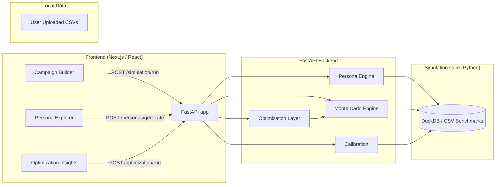

# AdSim — Agent-Based Advertising Simulation Engine

AdSim is a fully local, agent-based simulation platform for exploring how ad campaigns might perform **before** spending budget. It generates synthetic personas from public benchmark distributions, runs Monte Carlo simulations to estimate CTR/CPA/ROI, and layers simple reinforcement-style optimization to suggest better audiences, creatives, and platform mixes.

All components run locally with **no paid APIs**. External data comes from open/public benchmark datasets and optional user uploads.

| Link | URL |
|------|-----|
| **Repository** | [github.com/sasankgamini/AdSim](https://github.com/sasankgamini/AdSim) |
| **Live dashboard** | **[adsim-dashboard.vercel.app](https://adsim-dashboard.vercel.app)** |
| **Live API** | Deploy with [Render](https://render.com) using the included `render.yaml` — then add your API URL here |

**GitHub:** In the repo **About** (⚙️) set **Website** to **https://adsim-dashboard.vercel.app** so the link points to the live app. See **[Deployment](docs/DEPLOYMENT.md)** for API deploy steps.

---

## Quick start — run the app

**1. Backend (from repo root)**

```bash
cd /path/to/AdSim
python3 -m venv .venv
source .venv/bin/activate   # Windows: .venv\Scripts\activate
pip install -r backend/requirements.txt
uvicorn backend.main:app --reload --host 0.0.0.0 --port 8000
```

- API: **http://localhost:8000**
- OpenAPI docs: **http://localhost:8000/docs**

**2. Dashboard**

```bash
cd dashboard
npm install
npm run dev
```

- UI: **http://localhost:3000**

**Using the app**

- **Dashboard (http://localhost:3000)** — Campaign Builder, Simulation Results, Persona Explorer, and Optimization Insights use **demo/mock data** in the UI. To drive the UI from the backend, the dashboard would need to call the API (see below).
- **Backend API** — Use **http://localhost:8000/docs** to try:
  - `POST /personas/generate` — body: `{"n_personas": 500}` to get synthetic personas.
  - `POST /simulation/run` — body: `campaign` (name, objective, target_platform, creative_type, budget, ad_copy, creative_description, target_interests, target_age_min/max) and either `personas` (array) or `n_personas` (e.g. 1000). Returns CTR/ROI distributions and expected values.

---

## Deploy (Vercel + Render)

- **Dashboard:** **Live at [adsim-dashboard.vercel.app](https://adsim-dashboard.vercel.app).** Set the repo **About → Website** to that URL so the GitHub link points to the app.
- **Backend:** Import this repo on [Render](https://render.com); the `render.yaml` blueprint will create the API service. Use the resulting API URL as needed (e.g. for `NEXT_PUBLIC_API_URL` when wiring the dashboard to the API).

Full steps: **[docs/DEPLOYMENT.md](docs/DEPLOYMENT.md)**.

---

## Repository structure

- `backend/` — FastAPI application exposing persona generation, simulation, optimization, and calibration APIs
- `simulation/` — Python simulation core (personas, Monte Carlo engine, optimization, calibration)
- `data/` — Example benchmark CSVs and a place to store public datasets and user uploads
- `models/` — (future) ML models, e.g. CTR/response prediction using scikit-learn / transformers
- `scrapers/` — Playwright-based scrapers for pulling public benchmark tables when online
- `dashboard/` — Next.js + React + Tailwind dashboard UI

---

## Architecture overview

The platform follows a clean separation between simulation core, API, and UI.



### Key flows

- **Persona Engine** (`simulation/persona_engine.py`)
  - Uses demographic-style distributions (age, income, region, platform preference, interests) to generate 500–2000+ synthetic personas per simulation.
  - In a production setup, you would parameterize these distributions from public marketing/advertising datasets stored in `data/` and/or loaded via DuckDB.

- **Ad Campaign Model** (`simulation/campaign_model.py`)
  - Strongly-typed Pydantic model describing a campaign: objective, platform, creative type, budget, ad copy, audience constraints (age, interests).
  - Used by both the Monte Carlo engine and optimization layer.

- **Monte Carlo Simulation Engine** (`simulation/monte_carlo.py`)
  - For each campaign:
    - Samples a synthetic population of personas.
    - For thousands of iterations, simulates impressions, clicks, and conversions.
    - CTR is influenced by:
      - Platform + objective baseline CTR (from open benchmarks or local CSVs).
      - Persona-level features (interests, age fit, platform preference, attention span, ad fatigue).
    - Conversion probability is influenced by purchase intent, income, creative type, and objective.
  - Produces:
    - Iteration-level metrics and a **distribution** of CTR, CPC, CPA, and ROI.
    - Aggregated mean CTR/CPC/CPA/ROI for quick comparisons.

- **Optimization Layer** (`simulation/optimization.py`)
  - Simple **epsilon-greedy multi-armed bandit**:
    - Each “arm” is a variant of the base campaign (e.g., different platform, creative type, or age range).
    - Iteratively:
      - Picks an arm (exploit current best or explore).
      - Runs a smaller Monte Carlo simulation for that variant.
      - Updates value estimates based on simulated ROI.
  - Returns:
    - The best-performing variant.
    - Estimated value for each arm.
    - A step-by-step history of exploration vs exploitation.

- **Continuous Calibration** (`simulation/calibration.py`)
  - Accepts real campaign results uploaded by the user (impressions, clicks, conversions, spend).
  - Aggregates by platform + objective to compute empirical CTR and conversion rates.
  - Returns updated priors that can be fed back into:
    - Baseline CTR functions.
    - Benchmark tables in DuckDB / CSV.

- **Scrapers** (`scrapers/wordstream_ctr_scraper.py`)
  - Playwright-based helper to fetch public pages (e.g., WordStream or other benchmark articles), parse HTML tables into pandas DataFrames, and store them in `data/`.
  - Intended to be run manually when you have network access; results are stored locally and reused offline.

- **Frontend Dashboard** (`dashboard/` — Next.js app in `src/app/`)
  - Glassmorphism, dark-mode UI using Tailwind.
  - Pages:
    - `Dashboard` (root): high-level KPIs and animated CTR chart.
    - `Campaign Builder`: form to define a campaign and run Monte Carlo simulations.
    - `Simulation Results`: richer view of CTR/ROI distributions.
    - `Persona Explorer`: visualizes synthetic audience distributions and sample personas.
    - `Optimization Insights`: shows bandit results and best-performing arm.

---

## Backend — FastAPI service

Location: `backend/main.py`

### Endpoints

- `GET /health` — basic liveness check.
- `POST /personas/generate`
  - Body: `PersonaRequest` (currently just `n_personas` and an optional `seed`).
  - Returns: list of personas with fields like age, gender, interests, income, platform, purchase intent, ad fatigue, attention span, device, and location region.

- `POST /simulation/run`
  - Body: campaign definition plus either `personas` (array from `/personas/generate`) or `n_personas` (backend generates personas). Optional: `n_simulations`, `seed`, `revenue_per_conversion`, `default_cpc`, etc.
  - Returns: `meta`, `distributions` (CTR, conversion_rate, ROI with summary + histogram), and `expected` (e.g. `ctr_mean`, `roi_mean`, `avg_clicks`, `avg_spend`).

- `POST /optimization/run`
  - Body: `OptimizationRequest` (base campaign + optional exploration segments).
  - Runs epsilon-greedy bandit over campaign variants and returns:
    - `best_campaign`
    - `estimated_values` and `pulls` per arm
    - `history` of decisions.

- `POST /calibration/update`
  - Body: `CalibrationRequest` (historical results).
  - Returns aggregated priors by platform + objective.

> **Note:** Adding a file-upload endpoint for user datasets is straightforward with FastAPI’s `UploadFile` type and can be wired to persist CSVs into `data/user_uploads/` and register them in DuckDB.

### Running the backend locally

Run from the **repository root** so that `backend` and `simulation` are on the Python path:

```bash
cd /path/to/AdSim
source .venv/bin/activate   # after creating venv and installing from backend/requirements.txt
uvicorn backend.main:app --reload --host 0.0.0.0 --port 8000
```

The API will be available at `http://localhost:8000` and the OpenAPI docs at `http://localhost:8000/docs`. The `POST /simulation/run` endpoint accepts either pre-generated `personas` or `n_personas` (backend will generate personas when `personas` is omitted).

---

## Simulation core — personas, Monte Carlo, optimization

Location: `simulation/`

- `persona_engine.py`
  - Defines:
    - `PersonaRequest`: Pydantic model for generation parameters.
    - `Persona` dataclass (internal).
    - `generate_personas`: uses NumPy + pandas to sample demographic and behavioral traits from synthetic distributions.
  - Traits:
    - `age`, `gender`, `income`
    - `interests` (1–3 tags, biased by popularity)
    - `platform` preference
    - `device` type
    - `location_region`
    - `purchase_intent`, `ad_fatigue`, `attention_span` (Beta-distributed).

- `campaign_model.py`
  - `CampaignDefinition`: Pydantic model encapsulating:
    - Objective (`awareness`, `traffic`, `leads`, `sales`)
    - Platform (`Google`, `Meta`, `TikTok`)
    - Creative type (`image`, `video`, `carousel`, `text`)
    - Budget, ad copy, creative description.
    - Audience: age range, interests, keywords.

- `monte_carlo.py`
  - `SimulationRequest`: ties together a `CampaignDefinition`, number of personas, iterations, and seed.
  - `run_campaign_simulation`:
    - For each iteration:
      - Derives base CTR and CPC from simple benchmark lookups (you can replace this with DuckDB queries over `data/*`).
      - Computes per-persona CTR uplift from:
        - Interest overlap with campaign interests.
        - Platform match (e.g., Meta vs Instagram).
        - Age within target range.
        - Attention span and ad fatigue.
      - Samples clicks and conversions using NumPy random draws.
      - Tracks impressions, clicks, conversions, spend, CTR, CPC, CPA, and ROI.
    - Returns both per-iteration metrics and aggregate stats.

- `optimization.py`
  - `OptimizationRequest`: base campaign + list of segment overrides + number of trials.
  - `optimize_campaign`:
    - Builds an “arm” for each variant (e.g., different platform or creative type).
    - Runs an epsilon-greedy loop across `n_trials`:
      - Chooses an arm (explore/exploit).
      - Calls `run_campaign_simulation` with smaller parameters.
      - Updates running estimate of ROI for that arm.
    - Returns the best campaign configuration and per-arm ROI estimates.

- `calibration.py`
  - `CalibrationRequest` and `CalibrationExample` represent real-world campaign results.
  - `calibrate_models` aggregates CTR and conversion rates per platform/objective combination, which you can use to:
    - Update the benchmark tables in `data/`.
    - Adjust parameters inside `_base_ctr_from_benchmarks` or other priors.

---

## Data and models

Location: `data/`

- Example benchmark CSVs:
  - `sample_benchmarks/google_ads_ctr_benchmarks.csv`
  - `sample_benchmarks/meta_ads_ctr_benchmarks.csv`
- Extend this folder with:
  - Google Ads / Meta benchmark CSVs from public reports.
  - Kaggle advertising datasets.
  - UCI marketing datasets.
  - HubSpot / WordStream / Statista public (non-paywalled) reports.

You can connect DuckDB to this directory for ad-hoc analysis and to parameterize persona distributions:

```python
import duckdb

con = duckdb.connect("adsim.duckdb")
con.execute("CREATE TABLE google_bench AS SELECT * FROM 'data/sample_benchmarks/google_ads_ctr_benchmarks.csv'")
```

> **Models directory (`models/`)** is left for future work: you can load scikit-learn or HuggingFace models to refine CTR/response prediction using these datasets while keeping everything local.

---

## Frontend — Next.js dashboard

Location: `dashboard/`

- **Stack**
  - Next.js 14 (App Router).
  - React 18.
  - Tailwind CSS for styling (glassmorphism, dark mode).
  - Recharts for charts.

### Pages

- `app/page.tsx` — **Dashboard**
  - Overview cards for predicted CTR, CPA, and ROI.
  - Animated sample CTR chart.
  - Quick navigation to the main tools.

- `app/campaign-builder/page.tsx` — **Campaign Builder**
  - Form-based UI for:
    - Objective, platform, creative type.
    - Budget and age range.
    - High-level ad copy and creative description.
    - Interests (comma-separated).
  - On submit:
    - Calls `POST /simulation/run`.
    - Displays aggregated simulation metrics.

- `app/simulation-results/page.tsx` — **Simulation Results**
  - Automatically runs a demo simulation (if backend is live).
  - Visualizes:
    - CTR distribution (AreaChart).
    - ROI distribution (BarChart).

- `app/persona-explorer/page.tsx` — **Persona Explorer**
  - Calls `POST /personas/generate`.
  - Visualizes:
    - Platform preference pie chart.
    - Scrollable list of sample personas with income, region, interests, and behavioral traits.

- `app/optimization-insights/page.tsx` — **Optimization Insights**
  - Calls `POST /optimization/run` with a few variant arms.
  - Shows:
    - Best-performing arm and its campaign JSON.
    - Bar chart of estimated ROI by arm.

### Running the frontend locally

```bash
cd dashboard
npm install
npm run dev
```

Open `http://localhost:3000` in your browser. The current dashboard pages use **demo data** from `src/lib/demo-data.ts`. To use live simulation data, wire the Campaign Builder and Simulation Results pages to `POST /simulation/run` and `POST /personas/generate` (backend at `http://localhost:8000`).

---

## Extending the system

- **Data-driven personas**
  - Replace the hard-coded distributions in `persona_engine` with parameters derived from real datasets in `data/` via DuckDB queries.

- **Richer priors and models**
  - Use scikit-learn or HuggingFace transformers to learn CTR/response models from historic data and plug them into the Monte Carlo loop as per-persona click/convert probability estimators.

- **User-uploaded datasets**
  - Add a FastAPI file upload endpoint that:
    - Saves CSVs into `data/user_uploads/`.
    - Registers them with DuckDB.
    - Lets users select them as sources for persona distributions or calibration.

- **More advanced optimization**
  - Replace/simple augment epsilon-greedy with:
    - Thompson sampling.
    - Bayesian optimization libraries (e.g., scikit-optimize) that treat simulation as the objective function.

Everything is designed to stay local and transparent, so you can inspect and tweak each part of the simulation and optimization pipeline.

# AdSim — Data Ingestion & Calibration

This repository contains a **data ingestion system** to collect free advertising benchmark data and calibrate AdSim simulations.

## What it does

- Scrapes public benchmark pages (via Playwright) for:
  - industry CTR benchmarks
  - conversion rates
  - average CPC
  - average CPA
- Loads selected Kaggle advertising datasets (via Kaggle API) as additional signals.
- Normalizes all inputs into a single DuckDB schema:
  - `industry`, `platform`, `ctr`, `conversion_rate`, `cpc`, `cpa`, `ad_format`
- Produces **calibration distributions** that downstream personas can sample from.
- Includes an update pipeline to periodically refresh benchmarks.

## Quickstart

### 1) Setup

```bash
python -m venv .venv
source .venv/bin/activate
pip install -U pip
pip install -e ".[dev]"
python -m playwright install --with-deps
```

### 2) Run an ingestion update

```bash
python -m adsim_ingestion update --db ./data/benchmarks.duckdb --all
```

### 3) Generate calibration distributions

```bash
python -m adsim_ingestion calibrate --db ./data/benchmarks.duckdb --out ./data/calibration.json
```

## Kaggle credentials

The Kaggle loader uses the official Kaggle API. Configure one of:

- `~/.kaggle/kaggle.json` (recommended)
- or environment variables `KAGGLE_USERNAME` and `KAGGLE_KEY`

## Notes & constraints

- Some sources (notably Statista) may require authentication. The scrapers are implemented so they can run **headless** for public pages, and can optionally use a persisted Playwright profile if you have access.
- Scrapers store both **raw** extracted rows and **normalized** benchmark records so you can audit/adjust mappings over time.

